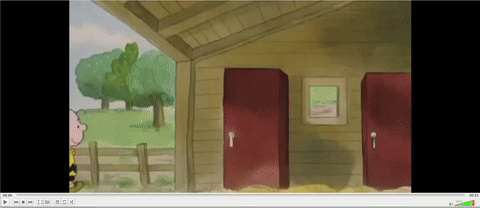

# Video Highlights Extraction and Chat System

A comprehensive solution that automatically extracts meaningful highlights from videos and provides an interactive chat interface to explore and interact with those highlights.

.


## 📋 Overview

This project combines two powerful components:

1. **Video Highlight Extractor**: Processes videos to automatically identify and extract important moments using Large Language Models (LLMs).

2. **Video Highlights Chat**: Provides a conversational interface to search, explore, and interact with the extracted video highlights.

## 🏗️ Architecture

```
project-root/
├── video-highlight-extractor/  # The highlight extractor code
│   ├── videos/                # Directory for video files
│   ├── src/                   # Source code
│   │   ├── main.py            # Entry point
│   │   ├── config.py          # Configuration settings
│   │   ├── processors/        # Video and audio processing
│   │   ├── llm/               # LLM and embedding services
│   │   ├── database/          # Database interaction
│   │   └── utils/             # Helper functions
├── video-highlights-chat/      # The chat interface code
│   ├── backend/               # Backend API code
│   │   ├── app/
│   │   │   ├── api/           # API endpoints and routes
│   │   │   ├── core/          # Core configuration
│   │   │   ├── data/          # Database access layer
│   │   │   ├── models/        # Data models and schemas
│   │   │   └── services/      # Business logic services
│   └── frontend/              # Frontend UI code
└── init-scripts/init-db.sql   # Database initialization script
```

## 🛠️ Technical Components

### Video Highlight Extractor

#### Video Processing (Compression)
The system reduces redundancy by:
- **Frame Extraction**: Processing every frame for maximum detail
- **Scene Detection**: Identifying significant changes between frames
- **Grouping**: Organizing frames into coherent segments
- **Representative Frames**: Selecting only key frames from each segment

#### Audio Processing
- **Audio Extraction**: Separates audio track from video
- **Speech Recognition**: Converts speech to text using Google's Speech Recognition API

#### LLM Integration
- **Highlight Description**: Generates detailed descriptions of important moments
- **Embedding Generation**: Creates vector embeddings for similarity search
- **Content Summarization**: Provides concise summaries of highlights

#### Database Storage
- **PostgreSQL with pgvector**: Stores video metadata, highlights, and vector embeddings
- **Vector Similarity Search**: Enables finding similar moments across videos

### Video Highlights Chat

#### Backend
- **API Layer**: Handles HTTP requests and responses (FastAPI)
- **Service Layer**: Contains business logic for processing chat queries
- **Data Access Layer**: Manages database interactions

#### Frontend
- **Interactive Chat**: The Streamlit frontend provides a simple chat interface 

## 🚀 Getting Started

### Prerequisites
- Docker and docker-compose
- Google AI Studio API key

### Installation

1. Clone the repository:
   ```bash
   git clone https://github.com/orlevit/Video_Highlights_Chat_System.git
   cd Video_Highlights_Chat_System
   ```

2. Add your videos to the `video-highlight-extractor/videos/` directory.

3. Create a `.env` file with your Google API key:
   ```
   GOOGLE_API_KEY=your_api_key_here
   ```

4. Start the containers:
   ```bash
   docker-compose up -d
   ```
5. open this address __http://localhost:8501/__ in the browser
   
## 👁️ Highlights view

- View video highlights: Run the following command to see the extracted video highlights from videos in `video-highlight-extractor/videos`:
```bash
./extractor_logs.sh
```
- Demo highlights
View the extracted highlights from the demo videos in: **`highlights.txt`**.
